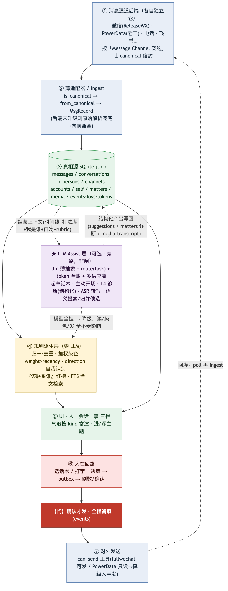
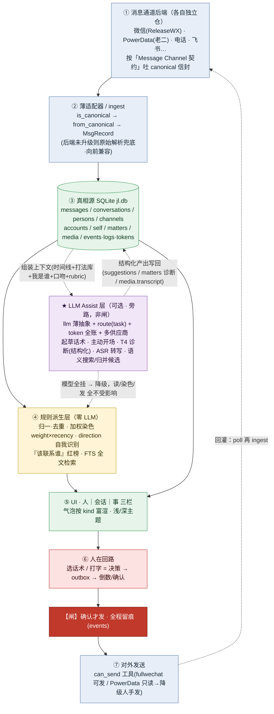
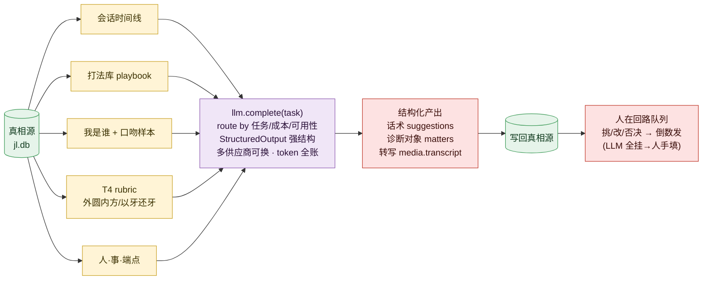

# AMR 数据 / 信息流转框架（含 LLM 的引入）

> AMR 是一个**信息路由器**：把多通道的人际信息归一进一个真相源，规则层做秩序与呈现，
> **LLM 作为可选旁路加智能**，**人在回路守住对外动作**。
> 核心 = **三个数据平面**分清 + 一条铁律：**LLM 是 assist，不是 gate**（LLM-optional）。
>
> 关联：[`Message Channel 规范化契约 v1`](../superpowers/specs/2026-06-26-message-canonical-contract-v1.md)、
> 渠道×工具路由特征、人在回路最高准则（见 `CLAUDE.md`）。

---

## 一、七段主流（数据怎么流）

1. **① 消息通道后端（各自独立仓）** —— 微信(ReleaseWX/老二)、PowerData、电话、飞书…… 按
   「Message Channel 契约」吐 **canonical 信封**（`schema:"message.canonical/1"` + `channel` +
   `kind` + 结构化子对象 + 必填 `direction`）。
2. **② 薄适配器 / ingest** —— `is_canonical → from_canonical → MsgRecord`；后端未升级则走原始解析
   兜底（向前兼容，后端吐 canonical 即自动消费）。
3. **③ 真相源 SQLite `jl.db`** —— 一切的中心：`messages / conversations / persons / channels /
   accounts / self_identities / matters / media / events · logs · tokens`。
4. **④ 规则派生层（零 LLM）** —— 归一·去重 · **加权染色 weight×recency** · `direction` 自我识别 ·
   『该联系谁』红榜 · FTS 全文检索。
5. **⑤ UI · 人｜会话｜事 三栏** —— 气泡按 `kind` 富渲（链接/文件/引用/系统…）、浅/深/跟随系统主题。
6. **⑥ 人在回路** —— 选话术 / 打字 = **决策** → `outbox` → 倒数 / 确认。
7. **⑦ 对外发送** —— `can_send` 工具（fullwechat 可发 / PowerData 只读→降级人手发）；发出后
   poll **回灌**再 ingest。

mermaid 源码（图1）

---

## 二、三个数据平面（关键认知）

| 平面 | 路径 | 是否依赖 LLM |
|---|---|---|
| **读 / 表示** | 通道 → canonical → 真相源 → UI | **纯规则、零 LLM**，模型全挂照常读 |
| **智能 / assist** | 真相源 → LLM → 结构化产出 → 真相源 | **LLM 插在这里，是旁路** |
| **动作 / HITL** | 人决策 → outbox → 确认 → 发 → 留痕 | **LLM 永不自动越这道闸** |

---

## 三、LLM 怎么引入

- **插入点**：起草话术 · 主动开场 · **T4 诊断(结构化)** · ASR 转写 · 语义搜索 / 归并候选。
- **走 `llm` 薄抽象**：`route(task)` 按**任务 / 成本 / 可用性**选供应商（Claude 主、本地兜底），
  多供应商**可换 = 注册非重构**，不硬编码单一 provider。
- **上下文组装**（从真相源拉）：会话时间线 + 打法库 playbook + 我是谁 self-profile + 口吻样本(已发消息)
  + T4 rubric + 人·事·端点 → 喂模型。
- **StructuredOutput 强结构**：逼模型出**可校验的结构化对象**（诊断 `{对方姿态/对等/圆/方/力/…}`、
  多版话术）——**这是 LLM（自由文本）与 真相源（结构化 DB）的缝合缝**。
- **产出写回真相源**：话术 → `suggestions`、诊断 → `matters`、转写 → `media.transcript` → 进
  **人在回路队列**（挑 / 改 / 否决 → 倒数发）。
- **Token 全账**：每次调用计量进 `tokens` 表。
- **铁律 LLM-optional**：模型全挂 → 降级到规则 + 人手，**读 / 染色 / 红榜 / 发 全不受影响**。
  LLM 是**加速器，不是命门**。

mermaid 源码（图2）

---

## 收

信息从通道汇入真相源（信息池）→ 规则层立秩序（归一 / 染色）→ **LLM 旁路加智能（可选 · 可换 · 可降级）**
→ 人守闸做决策与负责。这就是「**引入大模型、但人始终在回路、模型不掉链子也不绑架**」的流转框架。

> 渲染：PNG 在 `img/` 下，GitHub 直接显示；mermaid 源码可改后用 `mmdc` 重导
> （`npx -p @mermaid-js/mermaid-cli mmdc -i x.mmd -o x.png -s 2 -b white`）。
